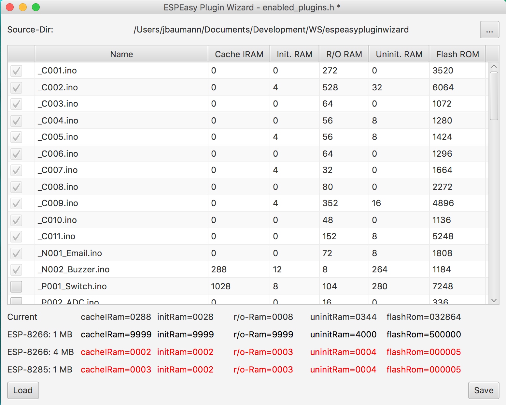

# ESPEasy Plugin Wizard

(https://travis-ci.org/jbaumann/ESPEasyPluginWizard.svg?branch=master)

This tool generates a plugin header file for enabling and disabling plugins in ESP Easy.



A list of files that add to the overall memory footprint is shown and plugins can be selected and deselected (enabled/disabled). Plugins are recognized by their name (i.e., the name starts with _\_P_ followed by a number).

If the current configuration has not been saved the last filename of the respective head file is shown in the window title together with a * to show that there are unsaved changes.

## The Memory Requirements
To help you decide which and how many plugins to enable it reads a file containing the memory requirements for the different plugins and shows the overall memory needs. Name and Directory of this file can be configured in the config file. The default name is _Plugin\_sizes.txt_ in the current directory.

The memory requirements for the typical ESP-configuration with 1M, 4M and the 8285 are shown in a list below the current memory requirements. If one of the current values exceeds the respective value in one of these memory configurations then that respective entry is colored red. This is only for information and does not in any way change the function of the program.

## Config file

The app looks for a config file named _epwconfig.yaml_. If it is available, it is assumed to be in YAML format and read. The following are the possible config options and their default values:
```
# This is the YAML config file for The ESPEasy Config Wizard


srcDirectory: "."                     # All Files are searched relative to srcDirectory
pluginData: Plugin_sizes.txt          # The file containing the memory requirements of the plugins
pluginHeaderFile: enabled_plugins.h   # The default file in which to save the enabled plugins
pluginPrefixPattern: "_P"             # The pattern used to identify plugins
# pluginPrefixPattern: "_P|_N"        # This pattern would identify more files as plugins
modifiedStyle: "-fx-background-color: mistyrose"  # The style used to highlight changed plugin values (enabled/disabled)
unmodifiedStyle: ""                               # The style used for unchanged plugin values
suffix: .ino                           # The suffix that identifies source files
```

## Source Directory

By changing the source directory you can add even plugins that are not in the original plugin list and add them to, even though for them naturally no size information is available. Still, if a header file is saved, the respective macro name is generated and saved to the file. You can click on the button on the right side, or alternatively, directly on the source directory label, and a file chooser is opened that allows you to pick a different source directory. The sources found there are added to the list. This allows e.g., to add plugins from the playground or from other sources as well for the header file generation.

## Header Files

### Reading a Header File
By clicking on the load button you can load an existing header file. This gets interpreted and the plugins enabled in the header file are enabled in the list as well. If macro names do not correlate to an existing plugin entry a new entry will be created (though without memory requirements).

### Writing a Header File
By clicking the save button you can save the current configuration in a header file. You can choose any possible file name, and this allows you to save different configurations in header files that you can easily activate.


## Warning: Here be Dragons

I have hacked this together during a weekend, so don't expect much. Especially no testing yet (I might add it later).
